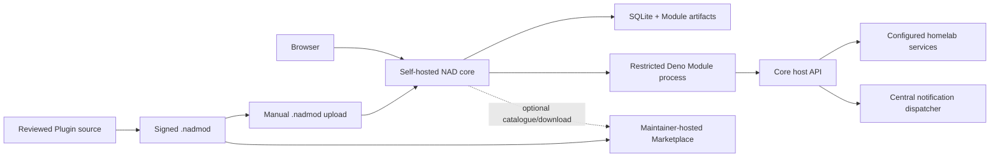
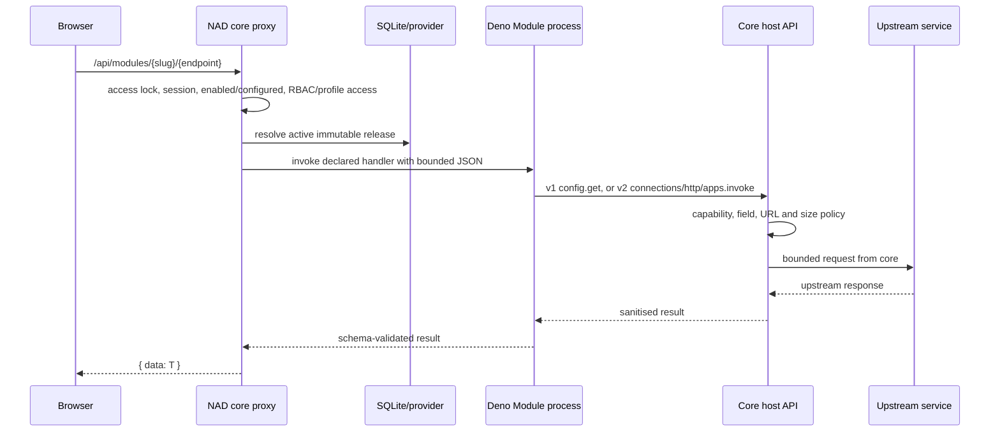

# Architecture

> Last reviewed: 2026-08-14

NAD is split into a self-hosted core, independently released Plugin packages,
and a maintainer-hosted Marketplace. This document describes durable system
boundaries, not the state of a particular release. The `VERSION` file and the
release notes carry current release identity.

## System boundary



The browser communicates only with local core routes. Server package code cannot
access the browser, core database, environment, filesystem, notification
credentials or network directly. Schema-v2 surface code runs only inside the
opaque sandbox and reaches package operations through the validated core bridge.
Both sides receive only the result required by their signed contract.

## Repository ownership

| Repository | Owns | Does not own |
|---|---|---|
| `nad` | Authentication, RBAC, configuration/encryption, Dashboard, notifications, package trust, runtime, lifecycle state, Marketplace client | Feature-specific clients, feature settings forms, Marketplace hosting |
| `nad-plugins` | Versioned SDK/types, schemas, CLI, testkit, Devkit generation, reviewed Plugin source and public keys | Dashboard accounts/data, hosted catalogue UI |
| `nad-marketplace` | App/Add-on/Collection catalogue, detail/docs pages, signed metadata, immutable package delivery and health endpoint | Package execution, signing private keys, Dashboard configuration |

Reviewed Plugins share a monorepo but build into independent immutable
packages. The runtime therefore does not depend on a repository per Plugin.
Community intake is disabled; any future workflow must build from reviewed
source rather than trust contributor-supplied package bytes.

## Core layers

| Area | Responsibility |
|---|---|
| `src/app/` | App Router Pages, Route Handlers, access checks, generic Module proxy, Settings install/catalog endpoints |
| `src/components/` | Shell, Workspaces, v1 declarative renderer, v2 sandbox host, Settings and shared UI |
| `src/lib/auth/` | Auth.js, process-local throttling, RBAC |
| `src/lib/db/` | SQLite connection, schema, startup migrations, audit |
| `src/lib/modules/` | Portable v1/v2 contracts, connections, installed provider, verifier, lifecycle, trust, runner, surfaces, App-operation broker and Host APIs |
| `src/lib/workspaces/` | Personal/shared/template Workspace, assignment, tab, instance, layout and access services |
| `src/lib/marketplace/` | Bound catalog and package client for a configured Marketplace origin |
| `src/lib/notifications/` | Central channel schemas, encrypted storage, providers and dispatcher |
| `src/lib/runtime/` | Persistent runtime data-directory resolution |
| `scripts/backup.mjs` | Verified database and active/retained Module artifact backup bundle |

There is intentionally no `src/modules/` feature tree and no React or upstream
service implementation loaded from an installed package.

## Package and trust model

A `.nadmod` is a bounded ZIP containing a manifest, an optional bundled server
file, signed UI/config/operation definitions and schemas, bounded assets,
license/readme, `checksums.json`, and `signature.json`. Schema-v1 Modules retain
their original fixed structure. Schema-v2 introduces `kind: app|addon`: an App
may own connections, HTTP scopes and exported operations; an Add-on declares an
exact App dependency and operation bindings but cannot own that App's
credentials or upstream network scopes. Collections are Marketplace metadata
only and are never executable packages.

Installation follows one path regardless of source:

1. Marketplace download is constrained to the configured origin/base path and
   checked against catalog length and SHA-256 metadata.
2. The common verifier rejects oversized archives, unsafe/duplicate paths,
   unsupported file types, suspicious compression ratios, incomplete checksum
   inventories, incompatible versions, invalid references, and untrusted or
   invalid Ed25519 signatures.
3. The verified content is extracted into a content-addressed immutable
   directory beneath the persistent NAD data directory.
4. A transaction records the release, package kind/raw manifest, grant
   generation, lifecycle operation, exact-digest trust and active pointer.
   Existing IDs, configuration, permissions and layout references remain
   attached across compatible conversion/update.

The same verifier handles a manually uploaded file. Unsigned development
packages are accepted only when the explicit `NAD_ALLOW_UNSIGNED_MODULES=true`
gate is set; this is not a production fallback.

The private release key is an offline publishing concern and never belongs in a
Dashboard, Marketplace image, or source repository. Core and `nad-plugins`
contain public key material only.

## Package request flow



Each invocation receives a short-lived process and scratch wrapper. The runner
denies direct network, environment, write, subprocess, system, FFI, and dynamic
import permissions; restricts reads to the generated wrapper; applies per-Module
concurrency, timeout, request, response, stdout and diagnostic bounds; then
kills the process and removes scratch state.

Schema-v2 calls pin the caller release, target App release and authorized
connection generation. Add-on-to-App calls are permitted only for a signed
dependency, compatible extension API and declared operation/binding. Core
derives the authenticated principal and validates both input and output; an
Add-on never receives target configuration or an opaque credential handle it
can redirect elsewhere.

### Host services

- `config.get` returns ordinary values but represents secret fields with opaque
  references.
- `http.request` is a core-brokered, bounded request. The signed package must
  declare each permitted scheme, configured host field, port source,
  exact/constrained path, method, header/query allowlists and read/write effect;
  all fields must match. Core may inject one declared secret into one exact
  request location without exposing it to package code. Query endpoints may use
  only read-effect scopes. Read-effect POST/DELETE additionally requires a
  broker-enforced body policy; GraphQL scopes accept query operations only.
- `notifications.emit` calls the central dispatcher through the authenticated
  invocation context. Provider operations have bounded deadlines; Modules never
  configure SMTP, Telegram or ntfy.
- `storage.get`, `storage.set` and `storage.delete` use the pinned Module KV
  generation with key/value/total quotas. Writes are mutation-only.
- `audit.annotate` accepts bounded primitive metadata and records core-owned
  actor, release, digest and endpoint attribution. It is mutation-only.
- Host API v2 replaces v1 global configuration reads with a selected connection
  context. Apps may read ordinary connection values and opaque secret references;
  exact signed HTTP bindings let core inject those secrets without returning
  them to package code.
- `apps.invoke` is available only to schema-v2 Add-ons for declared App
  operations and selected connection slots. Core checks dependency, API range,
  permission, profile access, schemas, exact releases, revocation and recursion
  limits before invocation.
- `diagnostics.emit` stores redacted, quota/rate/retention-bounded structured
  diagnostics. Notifications, storage and audit remain core-owned services in
  both API generations.

Mutation endpoints and operations declare their exact RBAC permission and audit
action. The schema-v1 Proxmox package and schema-v2 reference App exercise the
audited action path.

## Declarative UI

Schema-v1 Modules describe Pages and Widgets as data. Core owns their React,
design tokens, accessibility behavior, loading/error states, navigation and
refresh behavior.

Schema-v2 packages may instead declare self-contained HTML surfaces for Widget
or page slots. Core serves the exact active-digest bytes into a core-owned outer
opaque iframe, which creates an inner blob document running with
`sandbox="allow-scripts"`. The one-shot `MessagePort` bridge is bound to a
per-render session and exposes only declared bindings, connection summaries,
bounded diagnostics, theme/resize and safe navigation. The inner surface has no
NAD cookies, same-origin DOM access, forms, popups, top navigation or direct
network. A repeated/unexpected load closes the bridge and removes the surface.
Exact-digest review controls bridge eligibility; even reviewed code does not run
in NAD's origin.

Workspaces are core records. They may be personal, shared or templates, contain
ordered grid/full-surface tabs, and hold multiple Widget instances with distinct
connection selections. Workspace, package, surface, operation and connection
access are intersected server-side. Revoked access retains the layout reference
but renders a generic unavailable state without leaking data.

## Lifecycle and persistence

The visible lifecycle remains:

```text
installed -> enabled -> configured -> usable
```

Installation or update does not require a core image rebuild or process
restart. Releases are immutable. Updating records a new release and active
pointer, retains the previous release, and reuses stable configuration,
permissions, storage generation and layouts.

Lifecycle and configuration operations serialize through one database lock and
compare expected release/config/KV/grant pointers plus the registry epoch. Each invocation pins
one immutable release. Updates and ordinary disable/retained-uninstall drain
mutations; destructive uninstall drains all invocations. Explicit rollback,
disable, retain/delete uninstall, failed-install cleanup, old/new approval
differences and bounded pruning are implemented. Destructive removal validates
artifact paths, commits the non-executable database state, then performs
best-effort deletion; a crash may leave inert garbage but cannot leave a usable
database pointer at an artifact that was already moved.

Schema-v1 installed configuration reads one authoritative immutable generation. Migration
6 imports legacy settings only when an older external-Module installation has
no usable active generation, preserving upgrades without retaining a runtime
dual-read/write path. Schema-v1 updates reuse compatible config/KV generations;
declarative data migration semantics still need a write-capable reference
Module before they can be frozen.

Migrations 9 and 10 add schema-v2 release metadata, exact-digest surface trust,
encrypted immutable connection generations/access grants, bounded diagnostics,
roles and Workspace structures. A stable Default connection preserves migrated
configuration. Schema-v1 adapters remain active throughout the published
compatibility window; there is no destructive migration or dual-write
dependency.

## Marketplace boundary

`NAD_MARKETPLACE_URL` selects the hosted base URL. Core fetches a bounded signed
catalog, a separately signed sequenced security snapshot and immutable versioned
package URLs. Migration 8 stores the last verified recommendations, exact-digest
advisories and artifact/signing-key revocations. A five-minute in-process cache
coalesces administrator-triggered refreshes; sequence rollback, same-sequence
rewrite, invalid signature and expired metadata are rejected without clearing
known warnings. `NAD_MARKETPLACE_MODE=manual`
disables Marketplace traffic while retaining upload; `online` is the default.
The Marketplace is never
required for startup, login, Module execution, configuration, or updates from a
local file.

The Marketplace also exposes an additive static `/api/v2` product catalogue for
Apps, Add-ons and non-executable Collections. `/api/v1` remains byte-compatible
for deployed cores. Marketplace source includes a disabled invited-publisher
foundation, but production remains first-party-only until intake receives
explicit operational approval.
Administrators see persistent affected-release guidance. A verified critical
`quarantine` action blocks new execution and activation of the exact digest/key,
retains configuration, artifacts, grants and layout, and requires an explicit
safe replacement rather than silently deleting or re-enabling code.

## Shared core services

Authentication, user identity, permissions, audit, layouts, configuration,
secret encryption, notifications, package trust and host networking are core
services. A Module declares and calls them; it must not clone them. This avoids
separate SMTP credentials, user lists, alert configuration or authentication
logic inside every feature.

## Deployment and backup

The production Docker image uses Next.js standalone output, runs as numeric
UID/GID `1001:1001`, persists `/app/data`, and includes pinned Deno `2.7.7`.
Reviewed releases target Linux `amd64` and `arm64`. Compose probes
`/api/health`; authenticated `/api/build-info` must match the immutable image's
OCI version, revision, creation time and source labels. HTTPS and network
exposure remain reverse-proxy/firewall concerns.

`pnpm db:backup [dir]` uses SQLite's online backup API and creates manifest-v2
bundles with the database digest and a complete per-file inventory for active
plus retained Module artifacts. `db:backup:maintain` verifies a disposable copy
before applying count-based retention. Restore is an offline operator operation. Connections, trust,
diagnostics and Workspaces are in SQLite; active/retained package artifacts are
in the bundle. A database-only copy is not a complete installed-package backup.

## Security assumptions

- Administrators choose integration endpoints and therefore control a limited
  SSRF-capable surface; broker validation and exact configured-host matching
  reduce but do not eliminate that trust.
- Database plus `APP_SECRET` compromise exposes stored integration secrets.
- The process-local login limiter is a single-instance backstop, not public-edge
  rate limiting.
- Core signature trust validates provenance, not that a Module is bug-free.
- Sandboxed custom UI still receives results from explicitly approved bridge
  bindings. Package review, least-privilege manifests, RBAC, exact-digest trust
  and revocation all remain necessary.

The package compatibility contract, plugin authoring guides and the Plugin
Development Kit live in [`nad-plugins`](https://github.com/RoBroLabs/nad-plugins).
